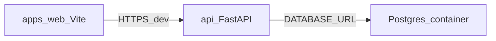

# Richme 实施总览（可执行细则见子计划）

## 子计划文件（仓库内，按序执行）

| 步骤  | 文档                                                             | 说明                                                                                                                      |
| --- | -------------------------------------------------------------- | ----------------------------------------------------------------------------------------------------------------------- |
| 1   | [docs/plans/01-scaffold.md](docs/plans/01-scaffold.md)         | 目录、Docker Compose PostgreSQL、api 骨架（**uv sync / uv run**）、`apps/web`（**pnpm**+Vite+Tailwind）、`.env.example`、README、验收命令 |
| 2   | [docs/plans/02-database-orm.md](docs/plans/02-database-orm.md) | 表字段清单、SQLAlchemy 模块布局、Alembic 初始化与 `env.py`、`upgrade head`、临时读库验证                                                       |
| 3   | [docs/plans/03-api.md](docs/plans/03-api.md)                   | 路由表、JWT、CORS、CRUD 路径、JSON 导入契约与事务规则、错误码、DoD                                                                             |
| 4   | [docs/plans/04-web-ui.md](docs/plans/04-web-ui.md)             | `VITE_API_BASE_URL`、Query、路由页、表格/导入 UI、响应式 DoD                                                                          |

索引：[docs/plans/README.md](docs/plans/README.md)

## 架构约定（摘要）

- **目录**：[apps/web](apps/web)（前端）；与 `apps` 同级的 [api/](api/)（FastAPI）。
- **前端**：**pnpm**（`apps/web`）；**后端**：`api/pyproject.toml` + **uv**（`uv.lock`）+ 同步 **Session** + **psycopg3**（`postgresql+psycopg://`）。
- **数据库**：仅 **Docker** 运行 PostgreSQL（根目录 `compose.yaml`），本地与云同形态；**勿对公网暴露 5432**。

## 已定选型

- Node / 前端：**pnpm**（`apps/web`，提交 `pnpm-lock.yaml`）。
- Python / 后端：**uv**（`api/`，提交 `uv.lock`；用 `uv sync`、`uv run`）。
- ORM：**SQLAlchemy 2 同步 Session** + **Alembic**；结构变更只走模型 + 迁移。

每份子计划文末有 **完成判定（Definition of Done）** 勾选清单；总览不再重复细节。

**维护者**：pnpm / uv 通常已安装；其它同类工具选型实装前须先确认。见 [docs/plans/MAINTAINER.md](docs/plans/MAINTAINER.md)。
