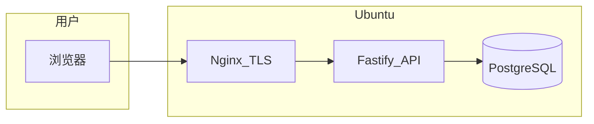

# Richme 个人股票笔记全栈 MVP 计划

## 目标与范围（与对话对齐）

- **业务**：离线股票字典（代码、名称、地域、行业等）+ **按交易日 + 主线（Theme）** 维护股票池与当日字段（收盘价、连板梯队、地位、备注、画布坐标可选）；**标签**按日挂在股票上；支持 **JSON 上传** 由服务端校验后入库。
- **客户端**：**仅 Web**，**响应式布局**（手机浏览器可用），不做独立 App。
- **服务端**：**Node + TypeScript + Fastify**；**PostgreSQL**；**HTTPS + JWT**（不绑 IP）；DB **仅 API 进程可连**。
- **原则**：简单够用、单仓库、可在一台 Ubuntu 云主机上跑通。

## 架构



本地开发：本机 PostgreSQL（或 Docker 仅跑 DB）+ `localhost` API；生产通过 `DATABASE_URL` 等环境变量切换。

## 仓库布局（建议）

Greenfield，采用 **pnpm workspace**（或 npm workspaces，二选一以你习惯为准；计划按 pnpm 写）：

- `[apps/api](apps/api)` — Fastify、Prisma、业务路由、JWT、JSON 导入
- `[apps/web](apps/web)` — React + Vite + Tailwind + TanStack Query
- `[packages/shared](packages/shared)`（可选）— 共享 Zod schema / 类型，避免前后端 JSON 合同漂移；**MVP 可省略**，先在 `api` 内定义 Zod，前端复制最小类型或 openapi 生成（若希望极简可先不共享包）

根目录：`[package.json](package.json)`、`[pnpm-workspace.yaml](pnpm-workspace.yaml)`、`[.env.example](.env.example)`（仅示例键名，无密钥）

## 数据模型（Prisma）

核心表（名称可微调，语义固定）：

| 模型              | 作用                                                                                   |
| --------------- | ------------------------------------------------------------------------------------ |
| `Stock`         | 股票主数据：`code`（唯一）、`name`、`exchange`、`region`、`industry` 等                             |
| `Theme`         | 主线/主题：`slug` 或 `name` 唯一，如「电力」                                                       |
| `DailyTheme`    | 某日启用的一条主线：`tradeDate` + `themeId`（可加 `narrative` 文本字段存「核心炒作逻辑」）                      |
| `DailyStock`    | 某日某主线下的个股快照：`tradeDate`、`themeId`、`stockCode`、收盘价、连板梯队、地位、备注、`layoutX`/`layoutY`（可选） |
| `Tag`           | 标签定义：`name`、`category`（可选）                                                           |
| `DailyStockTag` | 多对多：`tradeDate` + `stockCode` + `tagId`（与当日主线关联时可再挂 `themeId` 若需按主线隔离标签）             |

**索引**：`(tradeDate, themeId)`、`stockCode`、外键；导入与列表查询按日期+主线筛选。

**迁移**：Prisma Migrate，所有结构变更走 migration 文件。

## API 设计（Fastify）

- **插件**：`@fastify/jwt`、`@fastify/cors`、`@fastify/multipart`（若上传文件）或 `application/json` 大 JSON（加 body 限制）。
- **鉴权**：
  - `POST /auth/login`（单用户：`ADMIN_PASSWORD_HASH` + `JWT_SECRET` 环境变量；密码用 argon2/bcrypt）
  - 受保护路由：`Authorization: Bearer <access>`；可选 refresh（MVP 可只做 access 较长过期 + 重新登录，以简为先）。
- **公开/受保护划分**：列表与展示若仅自用，可 **全部需 JWT**（最简单）。
- **业务路由（示例）**：
  - `GET/POST /stocks` — 字典 CRUD 或仅 POST 批量 upsert（导入用）
  - `GET /themes`、`POST /themes`
  - `GET /days/:date/themes/:themeId` — 当日主线详情 + 股票列表 + 标签
  - `PUT /days/:date/themes/:themeId/stocks/:code` — 更新当日个股字段
  - `POST /days/:date/themes/:themeId/import` — body 为 JSON，**Zod 校验**后事务写入 `DailyStock` / `DailyStockTag`
- **错误**：统一 JSON 错误体；校验失败返回 400 + 明细。

## JSON 导入合同（示例形状，实现时固化到 Zod）

约定一种稳定结构即可，例如：

```json
{
  "tradeDate": "2026-03-29",
  "themeSlug": "power",
  "narrative": "可选：核心逻辑",
  "stocks": [
    {
      "code": "000001",
      "close": 12.34,
      "ladder": "3板",
      "role": "龙头",
      "tags": ["观察"],
      "memo": "",
      "layout": { "x": 10, "y": 20 }
    }
  ]
}
```

导入时：`Stock` 不存在可先创建占位或拒绝（MVP 建议 **拒绝并列出缺失 code**，强制先维护字典）。

## 前端（React + Vite）

- **路由**：React Router — 登录页、日历/日期选择、主线选择、**当日看板**（表格编辑 + 可选简易卡片网格用 `layout`）
- **状态**：TanStack Query 对接 API；表单可用受控组件或 React Hook Form（任选，保持轻量）
- **样式**：Tailwind，移动优先断点
- **图表/连板关系**：MVP 用 **列表 + 梯队分组** 即可；若需图，后续加 `react-flow`（本计划不强制第一版）

## 部署（文档化为主，代码可提供示例）

- 服务器：Ubuntu，安装 Node LTS、PostgreSQL、Nginx。
- **PostgreSQL**：监听 `127.0.0.1`，创建库与用户；`DATABASE_URL` 仅本机。
- **systemd**：`richme-api.service` 执行 `node apps/api/dist`（或 `pnpm --filter api start`）。
- **Nginx**：`proxy_pass` 到 `127.0.0.1:PORT`；Let’s Encrypt；静态资源可由 Vite build 后由 Nginx `root` 或仍由同一 Fastify `fastify-static` 托管（选一种：**Nginx 托管静态 + API 同域不同 path** 最简单）。

## 安全与运维（最小集）

- 环境变量：`DATABASE_URL`、`JWT_SECRET`、管理员密码哈希或 `ADMIN_PASSWORD`（仅首次启动写入哈希后删除明文，或手动生成哈希）
- CORS：生产仅你的域名；开发放行 `localhost`
- 备份：文档说明 `pg_dump` + 云盘快照周期

## 实施顺序

1. 初始化 monorepo、`apps/api` Fastify 骨架、健康检查、`/auth/login` + JWT。
2. Prisma schema 与首版 migration；种子脚本可选（插入测试 Theme/Stock）。
3. 实现 `DailyTheme` / `DailyStock` / `Tag` CRUD 与 JSON 导入接口。
4. `apps/web`：登录、日期+主线选择、当日编辑与保存、标签多选。
5. 补充 `README`：本地开发、环境变量、生产构建与 Nginx 示例配置片段。

## 刻意不做（保持小）

- 微服务、Redis、K8s、OpenAPI 代码生成（可后补）、复杂 RBAC、实时 WebSocket、移动端原生应用。
